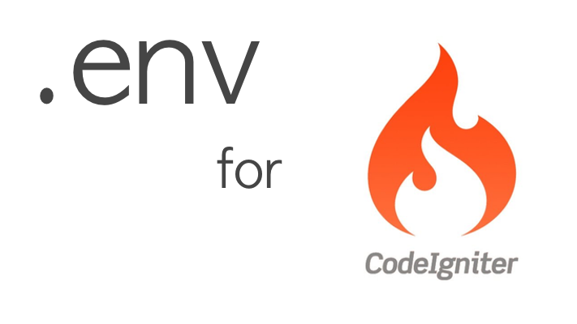

# PHP DotEnv for CodeIgniter 3.2.x
> Autodetect environment type and load variables from `.env`, `$_ENV` and `$_SERVER` automagically.




## Installation
1. Install Composer
```
$ curl -s http://getcomposer.org/installer | php
```

2. Paste all of these files to your CodeIgniter root.
3. Install package on `application` directory
```
$ cd application
$ composer install
```


## Configuration
1. Enable your Composer Autoload and Hooks: `application/config/config.php`

`$config['composer_autoload'] = FALSE;` to `$config['composer_autoload'] = TRUE;`

1. Add this code on index.php : `/index.php`

beefore `require_once BASEPATH.'core/CodeIgniter.php';`


```
require_once __DIR__ . '/vendor/autoload.php';
$dotenv = Dotenv\Dotenv::createImmutable(__DIR__);
$dotenv->load();

/*
 * --------------------------------------------------------------------
 * LOAD THE BOOTSTRAP FILE
 * --------------------------------------------------------------------
 *
 * And away we go...
 */
```

1. Create your *.env* files
```
$ cp .env.example .env
```


## Usage Example

### Database Configuration
1. Edit `database.php` on `application/config/database.php`
2. Replace this code:
```
	'hostname' => 'localhost',
	'username' => '',
	'password' => '',
	'database' => '',
	'dbdriver' => 'mysqli',
```

to
```
	'hostname' => $_ENV['DB_HOSTNAME'],
	'username' => $_ENV['DB_USERNAME'],
	'password' => $_ENV['DB_PASSWORD'],
	'database' => $_ENV['DB_DATABASE'],
	'dbdriver' => $_ENV['DB_DRIVER'],
```


## Contributing
1. Fork it!
2. Create your feature branch (`git checkout -b my-new-feature`)
3. Make your changes
4. Commit your changes (`git commit -am 'Add my feature'`)
5. Push to the branch (`git push origin my-new-feature`)
6. Create a new Pull Request
